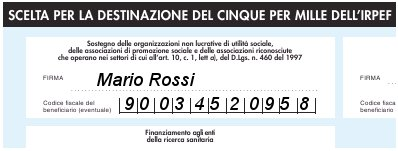

---
date:
  created: 2008-06-20
authors:
  - gmauro
description: >
  5x1000
tags:
  - 5x1000
---

# Con il tuo 5x1000, puoi sostenere i nostri progetti

{: style="display: block; margin: 0 auto;"}

La legge 27 dicembre 2006, n. 296 ha riproposto per l’anno 2007, la destinazione in base alla scelta del contribuente di una quota pari al 5 per mille dell’IRPEF a finalità di sostegno del volontariato, onlus, associazioni di promozione sociale e di altre fondazioni e associazioni riconosciute; finanziamento della ricerca scientifica e delle università; finanziamento della ricerca sanitaria; finanziamento agli enti della ricerca sanitaria.

**L'Associazione Sindrome di Crisponi e Malattie Rare ODV, c.f. 90034520958**, iscritta al Registro Generale del Volontariato Settore Sociale Sezione Assistenza Sociale con il n°1510, è tra i soggetti ammessi alla destinazione della quota.

Puoi aiutarci nel nostro volo, destinando la quota del 5 per mille della tua imposta sul reddito delle persone fisiche, relativa al periodo di imposta 2006, apponendo la firma sui modelli di dichiarazione nell'apposito riquadro dal titolo "Sostegno delle organizzazioni non lucrative di utilità sociale, delle associazioni di promozione sociale e delle associazioni riconosciute che operano nei settori di cui all’art. 10, c. 1, lett a), del D.Lgs. n. 460 del 1997" ed indicando il nostro codice fiscale 90034520958.

{: style="display: block; margin: 0 auto;"}

La scelta di destinazione del 5 per mille e quella dell’8 per mille di cui alla legge n. 222 del 1985 non sono in alcun modo alternative fra loro.