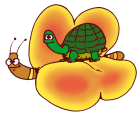

---
date:
  created: 2009-05-28
authors:
  - Coordinamento
description: >
  La sindrome
tags:
  - La sindrome
---
Relazione del Dott.G.Crisponi aggiornata ad Ottobre 2005

# La sindrome di Crisponi

La sindrome di Crisponi è è originata dalla mutazione del gene <i>CRLF1</i> che mappa sul cromosoma 19. Descritta nel 1996 in 17 bambini, 8 maschi e 9 femmine provenienti da 12 famiglie della Sardegna meridionale. Dopo tale segnalazione sono nati in Sardegna altri tre bambini (2 femmine e 1 maschio) per un totale di 14 famiglie. Recentemente sono stati segnalati in letteratura altri due bambini affetti, uno italiano ed un’olandese di origine portoghese. Sono stati segnalati ma non ancora divulgati nella letteratura medica altri bambini affetti dalla sindrome in due famiglie di origine turca in Germania, una bambina in Argentina, un bambino in Arabia Saudita, altri probabili casi dalla Grecia e dall’Italia.

{: style="display: block; margin: 0 auto;"}

### **Caratteristiche cliniche fondamentali**

Le caratteristiche cliniche fondamentali, evidenti già dalle prime ore di vita, sono rappresentate in sintesi da contrattura accessuale tetaniforme della muscolatura mimica e dell’orofaringe, con conseguente impossibilità alla suzione e alla deglutizione con scialorrea (salivazione abbondante) continua, pianto soffocato con periodi di apnea variabili, moderato ipertono accessuale con tendenza all’opistotono che si manifestano dopo stimoli anche lievi e durante il pianto e conferiscono al volto una particolare espressione. Le contratture tendono a scomparire nelle fase di quiete e nel sonno. Sono presenti aspetti dismorfici del viso con faccia ampia, naso grande con narici anteverse, filtro lungo, guance piene. Le mani presentano camptodattilia bilaterale con prevalente contrattura del 3 e 4° dito sul palmo e le altre dita sovrapposte. Talvolta sono presenti micrognatia, anomalie di inserzione della dita dei piedi, torcicollo e reflusso gastro-esofageo. Il decorso clinico è stato caratterizzato inoltre da grave difficoltà nell’alimentazione e dalla comparsa di febbre continuo remittente sui 38°C con puntate di ipertermia irregolare oltre i 42°C, in epoca variabile dalla nascita ad alcune settimane e accompagnate in alcuni pazienti da manifestazioni convulsive generalizzate. La maggioranza dei bambini è deceduta dopo un periodo di alcune settimane o mesi coincidente con febbre oltre i 41 °C. Sono attualmente viventi cinque soggetti su venti, quattro femmine e un maschio, la maggiore di anni 26 e l’ultima nata attualmente di 1 anno di età.

### **Evoluzione clinica**

L’evoluzione clinica di questi individui è stata contrassegnata da una lenta regressione della sintomatologia distonica, da una persistenza della distermia, lenta ripresa dell’alimentazione spontanea. Nel corso degli anni è comparsa una grave cifoscoliosi parzialmente corretta con l’uso del corsetto ma progressivamente ingravescente da richiedere in un caso l’ intervento chirurgico. In tutti i bambini dopo circa cinque anni dalla nascita si è manifestata una sudorazione paradossa, evidente in particolare nella stagione fredda, preceduta da brividi di freddo e copiosissima sudorazione con variabile frequenza settimanale. E’ presente un ritardo psicomotorio di variabile gravità. Tutte le indagini sinora eseguite non hanno fornito indicazioni utili per un inquadramento diagnostico. L’analisi del cariotipo con varie metodiche di bandeggio è risultata normale. La TAC e la risonanza magnetica non hanno evidenziato anomalie del SNC. Le numerose indagini per malattie metaboliche sono risultate nella norma. Le analisi elettromiografiche, sulla conduzione del nervo e le biopsie muscolari esaminate con tecniche istochimiche e immunoistochimiche non hanno evidenziato anomalie. Gli esami culturali eseguiti durante gli episodi di ipertermia su sangue, liquor, urine e feci sono risultati ripetutamente negativi, come gli indici di flogosi. Un basso dosaggio di Gaba sul liquor riscontrato in un paziente non è stato confermato in successivi analisi su altri bambini affetti.

{: style="display: block; margin: 0 auto;"}

### **Bibliografia**

Giangiorgio Crisponi - Autosomal recessive disorder with muscle contractions resembling neonatal tetanus, charateristic face, camptodactyly, hypertermia, and sudden death: A new sindrome? American Journal of Medical Genetics 62:365-371 (1996) P.Accorsi, L. Giordano, and F.Faravelli – Crisponi Sindrome: report of a further patient. American Journal of Medical Genetics 123A : 183-185 (2003) Eline A.Nannemberg, Rob Bijmer, Bjorn M VanGeel, and Raoul C.M. Hennekam – Neonatal Paroxysmal trismus and camptodactyly: The Crisponi syndrome. American Journal of Medical Genetics 133A : 90-92 (2005). .

Ulteriori informazioni mediche della Sindrome di Crisponi
[http://www.ncbi.nlm.nih.gov/pubmed/8723066?dopt=Abstract](http://www.ncbi.nlm.nih.gov/pubmed/8723066?dopt=Abstract)

In attesa di ulteriori aggiornamenti vi invitiamo a leggere l'articolo apparso il 23 Settembre 2013 su Galileo - Il giornale delle Scienze: 
["Sindrome di Crisponi: la ricerca parla italiano"](https://www.galileonet.it/blog_post/sindrome-di-crisponi-la-ricerca-parla-italiano/)
di Daniela DeVecchis
